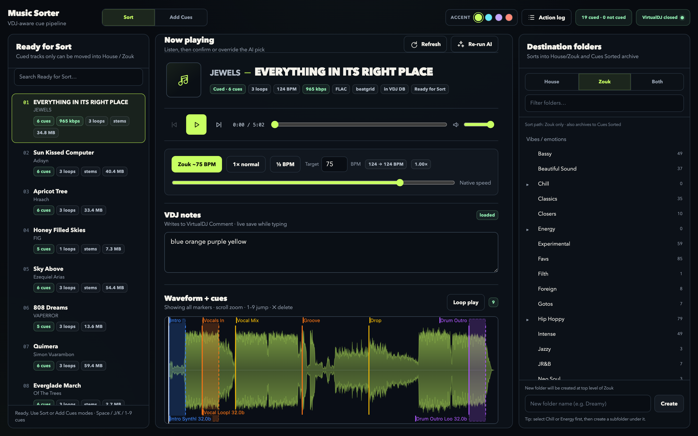
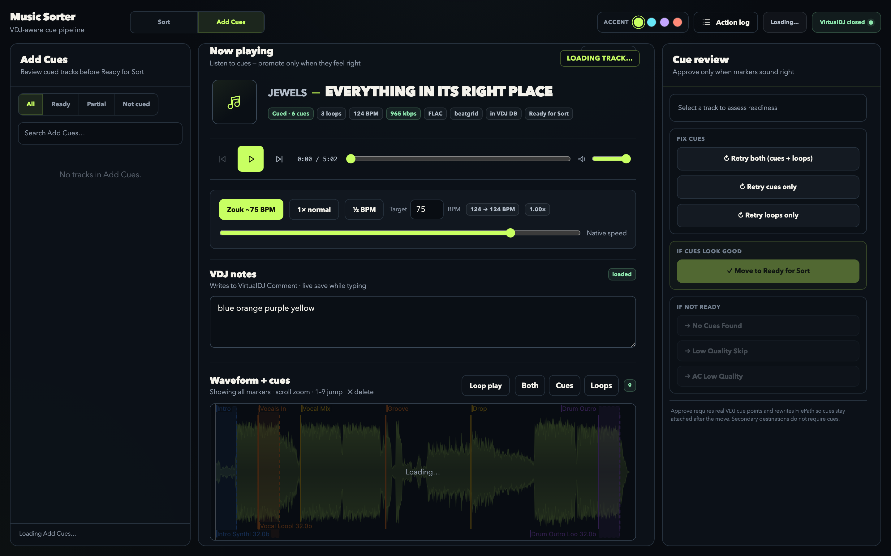
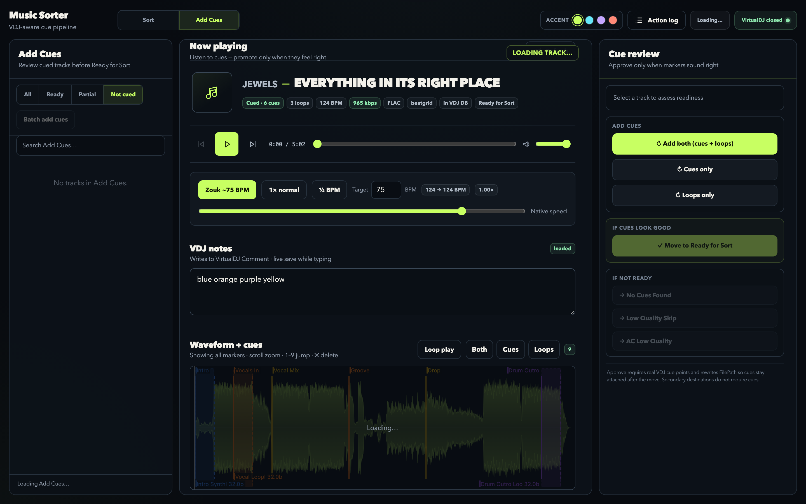
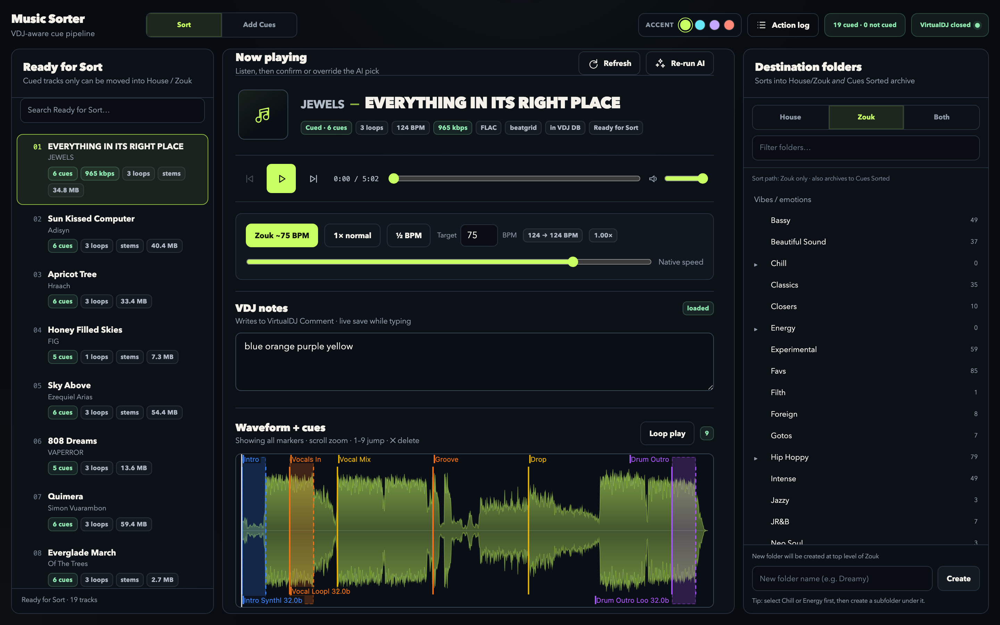

# Automatic Music Cuer for VirtualDJ

AI-powered cue & loop generation for VirtualDJ, plus a **local Music Sorter UI** for reviewing markers, re-running AutoCue, and sorting cued tracks into House / Zouk folders **without losing VirtualDJ cues**.

| Interface | What it’s for |
|-----------|----------------|
| **CLI** (`automatic_music_cuer_gemini.py`) | Batch / scripted AutoCue on files or folders |
| **Music Sorter UI** (`ui/`) | Day-to-day workflow: Add Cues review → Ready for Sort → library placement |

Both share the same surgical `database.xml` writer (`vdj_database_safety.py`) so FilePath moves and cue edits stay CRLF-safe on large libraries.

## Video Walkthrough (CLI AutoCue)

[](https://youtu.be/8868lOUFJQA)

Click the image above to watch the full CLI walkthrough on YouTube.

## Screenshots — Music Sorter UI

### Sort mode (Ready for Sort → House / Zouk)



Pick a cued track, listen, take Gemini’s folder suggestion (or choose/create a folder), then **Sort into folder**. VirtualDJ `FilePath` is retargeted so cues stay attached.

### Add Cues mode (review + AutoCue)



Review tracks under `Cues/Add Cues`: beatgrid preflight, waveform + cues/loops, **Both / Cues only / Loops only** AutoCue, delete markers, VDJ notes, then promote to Ready for Sort.

### Not cued queue



Filter to tracks that still need markers. Batch **Add cues** runs AutoCue across the queue (one database writer at a time; multiple jobs can queue).

### Track detail while sorting



Waveform, cue list (Both / Cues / Loops tabs), half-BPM helpers, and **Already in library** placements with optional delete (Trash + remove that path’s Song entry from VirtualDJ).

## Quick Start

```bash
# 1. Clone the repository
git clone https://github.com/langerkirill/vdj-automatic-cuer.git
cd vdj-automatic-cuer

# 2. Run the setup script (venv + Gemini API key)
./setup.sh

# 3. Activate the virtual environment
source venv/bin/activate

# 4a. CLI — analyze a track
python3 automatic_music_cuer_gemini.py "path/to/song.mp3"

# 4b. UI — Music Sorter (Add Cues + Sort)
./ui/run.sh
# open http://127.0.0.1:8787
```

The setup script installs CLI + UI dependencies and helps you set up your API key.

## What It Does

### AutoCue (CLI + UI)

- **Cue Points**: Marks important transitions (intro, drops, breakdowns, vocal entries, etc.)
- **Loops**: Adds only stable DJ-friendly loop candidates; some tracks produce none (loops need adjacent `.vdjstems`)
- **Color Name Comments**: Labels each cue with the musical elements present, making it easy to filter and find specific sounds when DJing
- **Write scopes**: full rewrite, **cues only**, or **loops only** (surgical; keeps the other kind)

### Music Sorter UI (supported workflow view)

- **Add Cues** — review queue, beatgrid preflight, run AutoCue, edit/delete markers, promote to Ready
- **Sort** — move cued tracks into House/Zouk emotion folders + Cues Sorted archive with FilePath relocate
- **Library cleanup** — delete a placement copy and its VirtualDJ Song (cues) without touching Ready
- **Gemini folder recommend** — suggests a destination crate from your folder catalog
## Platform Support

**Mac only** - This script automatically finds your VirtualDJ database at:

```
~/Library/Application Support/VirtualDJ/database.xml
```

For Windows/Linux support, you would need to manually specify the database path.

## Limitations

Before using this script, be aware of these important requirements:

- **Files must be pre-analyzed**: The audio file needs to have already been analyzed by VirtualDJ (so it exists in the database)
- **Beat grid required**: The track must have a VirtualDJ beat grid. The script now checks the downbeat phase against audio/kick-stem transients and can correct a clearly shifted "1", but you should still manually review unusual tracks.
- **Close VirtualDJ before running**: Do not make any edits in VirtualDJ while the script is running, as changes to the database will cause your edits to be lost
- **Restart required**: You must close and reopen VirtualDJ after running the script for the cue points to appear
- **Platform compatibility**: Primarily tested on Mac. Windows and Linux compatibility is uncertain and may require additional configuration
- **Accuracy limitations**: The default workflow is precision-first and may emit fewer cues or loops instead of guessing. Stem-backed component assertions are benchmarked, but model-only tracks still require review.
- **Long song limitations**: Really long songs (extended mixes, DJ sets) tend to have lower accuracy. The AI performs best on standard-length tracks (up to 6-7 minutes)

## Color System (My Personal DJ Preferences)

The colors reflect my DJing style and help me quickly find the right transition points:

- **Blue** - Melodic only (piano, strings, synth, guitar, bass) - NO drums or vocals

  - _Use case: Smooth ambient transitions, building tension_

- **Green** - Melodic + drums - NO vocals

  - _Use case: Instrumental breaks, building energy without lyrics_

- **Purple** - Drums/percussion only

  - _Use case: Perfect for transitions, drum breaks, mixing between tracks_

- **Yellow** - Drums + vocals, with or without melodic elements

  - _Use case: Peak energy moments, main sections of tracks_

- **Orange** - Vocals with no drums, with or without melodic elements
  - _Use case: Acapella sections, vocal-focused moments_

### Why Color-Coded Comments Matter

In VirtualDJ, you can **filter cues by color**. This means during a live set, I can:

- Quickly jump to "drums only" sections (purple) when I need a clean transition
- Find "melodic only" sections (blue) for smooth ambient mixing
- Locate vocal sections with drums (yellow) for peak energy moments

The comments are automatically added to each cue describing the exact musical elements, making it easy to remember what each color means.

## Prerequisites

Before running the setup, make sure you have:

- **Python 3.9 or higher** - Check with `python3 --version`
- **VirtualDJ installed** - The script modifies the VirtualDJ database
- **VirtualDJ database created** - Run VirtualDJ at least once to create the database
- **Gemini API key** - Get one from [Google AI Studio](https://aistudio.google.com/app/apikey)

## Setup

Run the setup script to get started:

```bash
./setup.sh
```

The setup script will:

- Create a Python virtual environment (venv)
- Install all required dependencies
- Prompt you to enter your Gemini API key
- Create a `.env` file with your API key and default model

**Note**: This uses Python's built-in `venv` (virtual environment), not `pyenv`. No additional tools needed beyond Python 3.9+.

### Gemini Model

The default model is `gemini-3.1-pro-preview`. It is the newest Pro model currently listed in the Gemini API docs and supports audio input plus structured JSON output, but it is still a preview model. If it hits rate limits, switch to the latest stable Pro model, `gemini-2.5-pro`, or the newest stable Gemini model overall, `gemini-3.5-flash`.

```bash
python3 automatic_music_cuer_gemini.py --model gemini-2.5-pro "path/to/song.mp3"
```

You can also set `GEMINI_MODEL=gemini-2.5-pro` in `.env`.

## Music Sorter UI

Full guide: [`ui/README.md`](ui/README.md).

### Launch

```bash
source venv/bin/activate   # optional if using ./ui/run.sh (uses repo venv)
./ui/run.sh
```

Open [http://127.0.0.1:8787](http://127.0.0.1:8787). Close VirtualDJ before database writes when possible.

### Recommended pipeline

1. Drop new files into `~/Music/DJ/Music/Cues/Add Cues/` (subfolders OK).
2. Analyze stems in VirtualDJ if you want **loops** (needs `filename.ext.vdjstems`).
3. In the UI → **Add Cues**:
   - Fix beatgrid / half-BPM if the preflight warns
   - **Add both**, **Cues only**, or **Loops only**
   - Listen, delete bad markers, edit VDJ notes
   - **Move to Ready for Sort** when markers sound right
4. **Sort** mode:
   - Select destination under House or Zouk (or accept Gemini’s pick)
   - **Sort into folder** — copies to library + Cues Sorted, retargets FilePath
   - If **Already in library**, use **✕ Delete** on a placement to Trash that copy and remove its VDJ Song

### Default folders

| Role | Path |
|------|------|
| Add Cues | `~/Music/DJ/Music/Cues/Add Cues` |
| Ready for Sort | `~/Music/DJ/Music/Cues/Ready For Sort` |
| Cues Sorted | `~/Music/DJ/Music/Cues/Cues Sorted` |
| House / Zouk | `~/Music/DJ/Music/House`, `…/Zouk` |
| VDJ database | `~/Library/Application Support/VirtualDJ/database.xml` |

### Why not Finder?

VirtualDJ keys cues by `FilePath` in `database.xml`. Moving files in Finder leaves the DB on the old path. The Sorter rewrites only that attribute (and can remove a whole Song when you delete a placement).

## CLI Usage

First, activate the virtual environment:

```bash
source venv/bin/activate
```

Then analyze your tracks:
```bash
# Analyze a single track (dry-run to preview changes)
python3 automatic_music_cuer_gemini.py --dry-run "path/to/song.mp3"

# Analyze and update VirtualDJ database
python3 automatic_music_cuer_gemini.py "path/to/song.mp3"

# Retry cues only (leave existing loops untouched)
python3 automatic_music_cuer_gemini.py --cues-only "path/to/song.mp3"

# Retry loops only (leave existing cues untouched)
python3 automatic_music_cuer_gemini.py --loops-only "path/to/song.mp3"

# Force a different Gemini model
python3 automatic_music_cuer_gemini.py --model gemini-3.5-flash "path/to/song.mp3"

# Process an entire folder (1 song at a time by default — safest for large libraries)
python3 automatic_music_cuer_gemini.py "path/to/folder"

# Optional: process 2 at a time if you have free RAM and a stable API quota
python3 automatic_music_cuer_gemini.py --batch-size 2 "path/to/folder"
```

**Note**: Defaults to one song per batch. That keeps peak RAM low on large VirtualDJ libraries (tens of thousands of tracks) and avoids host freezes. Database updates now rewrite only the matching `<Song>` block instead of loading the entire `database.xml` tree into memory.

### Precision Workflow

The default analysis path separates creative structure detection from factual
component assertions:

1. Gemini 3.1 Pro runs with high thinking and proposes structural boundaries,
   transition roles, and optional loop candidates.
2. The prompt allows 0-3 loops. It no longer forces vocal, drum-only, or
   melodic-only loops when those sections do not exist.
3. Candidate cue and loop timestamps both snap to the verified four-beat
   downbeat grid before any audio evidence is measured (mid-bar loop starts
   are rejected — they feel off-beat and often land on the wrong phrase).
4. Each adjacent `.vdjstems` stream is decoded once and calibrated against that
   track rather than using fixed loudness thresholds.
5. Broad components are asserted from measured vocal, kick/hi-hat, bass, and
   instrument stems. Low-confidence components are recorded as uncertain and
   excluded from names/colors.
6. Cue names and colors are recomputed from the verified component set.
7. `Drop` and `Breakdown` names are downgraded when the measured energy shape
   does not support the assertion.
8. Loops must keep a stable component signature near the start, middle, and end.
   Unstable loops are rejected before database writing.
9. Loops also need a clean wrap-around seam: every active stem must keep similar
   level and envelope shape at the head and tail. Evolving jazz/R&B sections
   (for example Matthew Halsall or Masego choruses that change texture) are
   rejected even when the same broad components stay "present".
9b. After stem gates pass, a **Gemini wrap listen** builds a short clip of the
    **last 3s of the loop followed by the first 3s** (end before start; splice
    in the middle). Gemini must hear **no easily perceptible difference** at
    that wrap. Shorter loops use half the loop length per side (still end→start).
9c. If the wrap fails, the system **retries up to 3 times** by nudging the start
    ±1–2 beats (and optionally shortening the length). Loops **prefer beat 1**
    but may start on other beats when that wraps better. **Zero loops is fine**
    when nothing passes.
10. Without an adjacent `.vdjstems` file, all loop candidates are dropped. Cues
    may still be written from the full mix; loops require stem proof.
10b. A stem beat-scan always supplements Gemini: early instrument-only phrases
    (intro melodic 8-counts such as Sasha Keable - heal something) are ranked
    highly (downbeats preferred) and merged with any model loops that already
    passed the gates.
11. A final precision gate rejects cues below 0.70 confidence, loops below 0.75,
   componentless assertions, invalid loop lengths, and duplicate cues that
   would snap to the same downbeat.
12. The writer repeats the same quantization before creating VirtualDJ POIs.

Component precision can be checked against the manually corrected stem-backed
reference tracks:

```bash
python3 cue_accuracy_benchmark.py
```

The benchmark fails if asserted-color precision or coverage falls below 95%.
It is a regression gate, not a claim that every genre or unseen track is 95%
accurate.

### Automatic Post-Cue Audit

After **each successful write**, the cuer now automatically:

1. Reloads the track’s cues from `database.xml`
2. Renders a waveform SVG with **bar-grid lines** and cue markers
3. Compares every cue/loop against the beatgrid (flags off-“1” placement and Phase/beatgrid mismatches)
4. Appends results to `audit_reports/auto/<timestamp>/` (`index.html`, per-track SVG, `summary.tsv`)

Disable with `--no-audit`. Custom folder: `--audit-dir path/to/dir`.

### Visual Cue Audit

After cueing, generate a read-only visual audit report that overlays every cue on
the waveform and, when adjacent `.vdjstems` files exist, the separated drum,
vocal, bass, and instrument lanes:

```bash
python3 cue_visual_audit.py "path/to/folder" --output audit_reports/my-run
```

The report writes:

- `index.html` - links to one SVG report per track
- `all_cues.tsv` - every cue/loop with color, inferred elements, and energy shape
- `issues.tsv` - likely name/color mismatches and timing-shape review flags

Stem-backed name/color issues are the strongest signal. Tracks without
`.vdjstems` are limited to mixed-waveform placement review. When a cue name
claims a section is a `Drop` or `Breakdown` but the waveform does not show the
expected energy rise/drop, the audit now includes a concrete fix direction:
rename the cue when the timing is musically useful but the label is wrong, or
move the cue when the real drop/breakdown is elsewhere. Rename suggestions
include labels such as `Rhythm Section`, `Vocal Mix`, or `Synth Section`.

### Curated Cue Fixes

When a cue set is manually reviewed, save the exact corrected POIs as a JSON
patch under `cue_fixes/`. Apply those corrections without rerunning Gemini:

```bash
python3 vdj_cue_patch.py --dry-run
python3 vdj_cue_patch.py
```

The patcher refuses to write while VirtualDJ is running, creates a timestamped
backup, validates the replacement XML structure, and reads the patched tracks
back from the candidate database before replacing `database.xml`.

Use curated patches for obvious manual-review fixes: misleading drop/breakdown
names, wrong stem-backed colors, or loops labeled drums-only when synth/bass or
vocals are active. After applying a patch, rerun `cue_visual_audit.py` on the
track or folder; the goal is for patched tracks to come back with no high-signal
stem/name/color issues.

### Code Layout

- `automatic_music_cuer_gemini.py` - CLI and backwards-compatible imports
- `vdj_cuer/` - Gemini analysis, stem handling, beatgrid checks, cue writing, and single/batch processing
- `ui/` - **Music Sorter** local web UI (Add Cues + Sort); FastAPI + static frontend
- `ui/run.sh` - launch the UI on `http://127.0.0.1:8787`
- `docs/screenshots/` - UI screenshots used in this README
- `cue_visual_audit.py` - CLI and backwards-compatible imports for visual audit reports
- `vdj_audit/` - database loading, audio envelopes, cue inspection, and report rendering
- `vdj_cue_patch.py` - curated manual cue correction patches
- `vdj_database_safety.py` - shared XML/database replacement guard (CLI + UI)

### Supported File Formats

The script handles all common audio formats including MP3, FLAC, WAV, and M4A. File sizes up to 200+ MB are supported, though extremely large files may take longer to upload and analyze.

## How It Works

1. **Stem Check**: Uses adjacent VirtualDJ `.vdjstems` files when available
2. **Upload**: Sends your audio file and available VDJ stems to Gemini AI
3. **Structure Proposal**: Gemini 3.1 Pro listens to the complete track and identifies:
   - Musical elements (drums, bass, vocals, synth, piano)
   - Timing of transitions (when elements enter/exit)
   - Loop-friendly sections for DJing
4. **Beatgrid Verification**: Uses VDJ's BPM as the tempo prior, scores the stored grid against onset energy, applies fine offset correction only with strong kick-stem confidence, and falls back to multi-source bar-phase consensus when the kick stem is silent
5. **Early Quantization**: Snaps cues to verified beat 1 and loops to a beat before measuring their component or energy assertions
6. **Calibrated Stem Evidence**: Verifies broad component claims against each track's own stem activity and abstains on uncertain components
7. **Assertion Validation**: Recomputes names/colors and downgrades unsupported Drop/Breakdown claims
8. **Loop and Precision Gates**: Rejects unstable, weak, invalid, or duplicate assertions and shortens loops that cross a section boundary
9. **Database Update**: Rechecks quantization and safely writes cue points after XML parse, song-count, cue-count, and file-size checks
10. **Backup**: Automatically creates timestamped backups before any changes

## What Gets Created

### Cue Points (5-6 per track)

- Intro
- Drums In
- Vocal Entry
- Breakdown
- Drop/Build-up
- Outro

### Loop Segments (0-3 per track)

- **Drum Loop** (16-32 beats): Only when drums are isolated and stable
- **Vocal Loop** (16-32 beats): Only when vocals remain present for the loop
- **Melodic Loop** (16-32 beats): Only when melody is isolated from drums/vocals

## Output Format

Each cue includes:

- **Timestamp**: Precise timing (rounded to 0.01s)
- **Name**: Descriptive label (e.g., "Drums In", "Vocal Drop")
- **Color**: Based on musical elements present
- **Comment**: Lists detected elements (e.g., "drums, bass, synth")

## VirtualDJ Integration

After running the script:

1. **Close and reopen VirtualDJ**: You must fully quit and restart VirtualDJ for the cue points to appear

2. **View your cues**:

   - Open the track in VirtualDJ
   - Cues appear in the waveform with assigned colors
   - Hover over cues to see comments

3. **Filter by color**:
   - Use VirtualDJ's cue filter to show only specific colors
   - Perfect for finding transition points during live sets

## Safety Features

- **Automatic Backups**: Creates timestamped backup before every change
- **Dry-Run Mode**: Preview changes without modifying database
- **VirtualDJ Process Guard**: Refuses real database writes while VirtualDJ is running
- **Beatgrid Downbeat Check**: Verifies cue snapping against audio transients and persists confident fine-offset or whole-beat downbeat corrections
- **Surgical Song Rewrite**: Updates one `<Song>` block without building a full DOM of a multi‑10k track library
- **Streaming Integrity Checks**: Song/cue counts are streamed, not fully parsed into memory
- **Per-Track Audio Cache**: Stem/mix envelopes decode once, then release after each track
- **Stem-Backed Confidence**: Precision gate uses measured stem activity, not optimistic model scores
- **Atomic Writes**: Uses temporary files to prevent corruption
- **Retry Logic**: Handles network errors gracefully with automatic retries

## Troubleshooting

### "GEMINI_API_KEY not found"

- Ensure `.env` file exists in this repository directory
- Check that API key is correctly formatted: `GEMINI_API_KEY=AIza...`
- Check that `GEMINI_MODEL` is set to a model your API key can access, such as `gemini-3.1-pro-preview` or `gemini-2.5-pro`

### "Database not found"

- Verify VirtualDJ is installed and has been run at least once
- Check path: `~/Library/Application Support/VirtualDJ/database.xml`

### "Upload failed" or "SSL errors"

- Check internet connection
- Script will automatically retry up to 5 times
- Large files may take longer to upload

### Cues not appearing in VirtualDJ

- Close and reopen

## Example Output

```
Automatic Music Cuer initialized with Gemini
VDJ Database: ~/Library/Application Support/VirtualDJ/database.xml
Database backed up to: database.xml.backup.20250124_143022
Analyzing song.mp3 with Gemini...
Uploading audio file (8.2 MB)...
Upload complete
Analyzing audio with Gemini...
Analysis complete: 6 cues, 3 loops

Cue 1: Intro at 0.00s - [synth] - Color: blue
Cue 2: Drums In at 45.23s - [drums, synth] - Color: green
Cue 3: Vocal Drop at 92.15s - [drums, vocals, synth] - Color: yellow
...

Successfully updated VDJ database with cues and loops
```

## Customization

To modify the color system for your preferences, edit the `color_mappings` dictionary in [automatic_music_cuer_gemini.py](automatic_music_cuer_gemini.py):

```python
self.color_mappings = {
    "blue": "4278190335",    # Your custom color
    "green": "4278255360",   # Your custom color
    ...
}
```

And update the color rules in the Gemini prompt.
